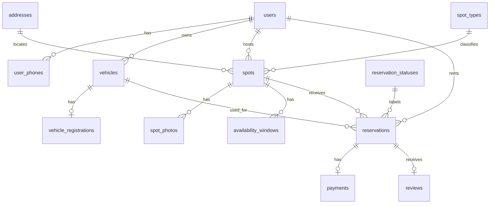

# Parking Shark Final Report Draft

CS 4750 Database Systems - Spring 2026

Team members:
- Adithya Balasubramaniam (rfb3mg)
- Rohan Singh (psw2uw)
- Angad Brar (zqq4hx)
- Visvajit Murali (dpc8jy)

Source code: https://github.com/visva-murali/parking-shark

## 1. Database Design

Parking Shark is a peer-to-peer parking marketplace. Users can list parking spots as hosts and reserve spots as renters. The relational schema is normalized around users, vehicles, addresses, spot listings, availability, reservations, payments, and reviews.

### Final E-R Diagram



### Final Tables

The final schema is in `sql/schema.sql`. It defines 13 normalized application tables:

- `users`
- `user_phones`
- `vehicles`
- `vehicle_registrations`
- `addresses`
- `spot_types`
- `spots`
- `spot_photos`
- `availability_windows`
- `reservation_statuses`
- `reservations`
- `payments`
- `reviews`

The full `CREATE TABLE` statements are included in `sql/schema.sql` and should be attached or copied into the PDF report as the final schema statements.

## 2. Database Programming

### Database Hosting

Development database: MySQL 8 running locally.

Production/shared database for demo: **TODO: fill in Cloud SQL instance name or other hosted MySQL location.** If using GCP extra credit, include screenshots from Google Cloud Console showing the Cloud SQL instance and database.

### App Hosting

Development app environment: Node.js 20, Express 4, EJS, Bootstrap 5, MySQL 8.

Production app for demo: **TODO: fill in deployed app URL and hosting environment.** If using GCP extra credit, include the App Engine URL and screenshots from App Engine.

### Deployment and Run Instructions

1. Install Node.js 20 and MySQL 8.
2. Install dependencies:

```bash
npm install
```

3. Create and seed the database:

```bash
mysql -u root -p < sql/schema.sql
mysql -u root -p < sql/migration_auth.sql
```

4. Edit `sql/grants.sql` and replace both `REPLACE_WITH_STRONG_PW` placeholders with real passwords, then run:

```bash
mysql -u root -p < sql/grants.sql
```

5. Configure environment variables:

```bash
cp .env.example .env
```

Set `DB_HOST`, `DB_PORT`, `DB_NAME`, `DB_USER`, `DB_PASS`, and `SESSION_SECRET`.

6. Start the app:

```bash
npm start
```

Open `http://localhost:3000`.

Seed users can log in with password `password123`, for example `ac@virginia.edu`.

### Advanced SQL Incorporated in the App

The app uses the advanced SQL objects in `sql/schema.sql`.

`prevent_double_booking` trigger:
This trigger runs before every insert into `reservations`. It checks whether the same spot has an overlapping `Pending` or `Confirmed` reservation. If a conflict exists, it raises `SQLSTATE '45000'`. This protects the database even if two users try to reserve the same spot concurrently.

`create_booking` stored procedure:
The booking form in `views/spots/detail.ejs` posts to `POST /reservations`. The route in `routes/reservations.js` calls:

```js
await conn.query('CALL create_booking(?, ?, ?, ?, ?, ?, @new_id)', [
  spotId,
  req.session.user.user_id,
  vehicleId,
  start_time,
  end_time,
  payment_method || 'Credit Card',
]);
```

The stored procedure performs rate lookup, total cost calculation, conflict checking, reservation insert, payment insert, and transaction commit as one atomic database operation.

CHECK constraints:
The schema enforces valid ratings, positive hourly rates, valid payment statuses, valid availability kinds, and reservation time order. These constraints keep invalid domain values out of the database even if application validation is bypassed.

## 3. Database Security at the Database Level

Database-level security is defined in `sql/grants.sql`.

The app uses the `ps_app` MySQL account for end-user operations. This user has only the minimum DML privileges needed by the web application. It can read lookup tables, manipulate user/application records through approved tables, execute the booking procedure, and manage the session table. It is explicitly denied destructive schema privileges such as `DROP`, `ALTER`, `TRIGGER`, routine modification, references, and grant option.

Developers use the `ps_dev` account, which has full privileges only on `parking_shark.*`, not on unrelated databases.

Privilege commands:

```sql
CREATE USER 'ps_app'@'%' IDENTIFIED BY 'REPLACE_WITH_STRONG_PW';
GRANT SELECT, INSERT, UPDATE, DELETE ON parking_shark.users TO 'ps_app'@'%';
GRANT SELECT, INSERT, DELETE ON parking_shark.user_phones TO 'ps_app'@'%';
GRANT SELECT, INSERT, UPDATE, DELETE ON parking_shark.vehicles TO 'ps_app'@'%';
GRANT SELECT, INSERT, UPDATE, DELETE ON parking_shark.vehicle_registrations TO 'ps_app'@'%';
GRANT SELECT, INSERT, UPDATE ON parking_shark.addresses TO 'ps_app'@'%';
GRANT SELECT, INSERT, UPDATE, DELETE ON parking_shark.spots TO 'ps_app'@'%';
GRANT SELECT, INSERT, DELETE ON parking_shark.spot_photos TO 'ps_app'@'%';
GRANT SELECT, INSERT, UPDATE, DELETE ON parking_shark.availability_windows TO 'ps_app'@'%';
GRANT SELECT, INSERT, UPDATE, DELETE ON parking_shark.reservations TO 'ps_app'@'%';
GRANT SELECT, INSERT, UPDATE, DELETE ON parking_shark.payments TO 'ps_app'@'%';
GRANT SELECT, INSERT, UPDATE, DELETE ON parking_shark.reviews TO 'ps_app'@'%';
GRANT SELECT ON parking_shark.spot_types TO 'ps_app'@'%';
GRANT SELECT ON parking_shark.reservation_statuses TO 'ps_app'@'%';
GRANT EXECUTE ON PROCEDURE parking_shark.create_booking TO 'ps_app'@'%';
REVOKE DROP, ALTER, CREATE VIEW, CREATE ROUTINE, ALTER ROUTINE,
       TRIGGER, REFERENCES, GRANT OPTION
    ON parking_shark.* FROM 'ps_app'@'%';
```

## 4. Database Security at the Application Level

Application-level security is implemented with authentication, password hashing, server-side sessions, authorization middleware, ownership checks, parameterized SQL, and controlled execution flow.

Passwords are hashed with bcrypt:

```js
const hash = await bcrypt.hash(password, 12);
```

Login compares the submitted password to the stored hash:

```js
if (!user || !(await bcrypt.compare(password, user.password_hash))) {
  return res.render('auth/login', {
    title: 'Log in',
    error: 'Invalid email or password.',
    form: req.body,
  });
}
```

Protected routes use `requireLogin`:

```js
function requireLogin(req, res, next) {
  if (!req.session.user) {
    req.session.flash = { type: 'warning', msg: 'Please log in to continue.' };
    return res.redirect('/login');
  }
  next();
}
```

Host-only spot management uses `requireSpotOwner`, and reservation pages/actions use `requireReservationOwner` to ensure only the renter or host can view or modify the reservation.

The booking route also validates that the user is not booking their own spot and that the vehicle belongs to the logged-in user before calling the stored procedure:

```js
const [[vehicle]] = await conn.query(
  'SELECT vehicle_id FROM vehicles WHERE vehicle_id = ? AND user_id = ?',
  [vehicleId, req.session.user.user_id],
);
if (!vehicle) {
  req.session.flash = { type: 'danger', msg: 'Choose one of your own vehicles.' };
  return res.redirect(`/spots/${spotId}`);
}
```

All database access uses parameterized queries with `?` placeholders, preventing SQL injection through user input.

## 5. Application Requirements Coverage

- Retrieve data: browse spots, view spot details, dashboards, profile, vehicles, reservations.
- Add data: register users, add spots, add vehicles, add phone numbers, create reservations, add reviews, add photos, add availability windows.
- Update data: edit profile, edit spots, verify registrations, update reservation status, extend reservations, mark payments paid, update reviews.
- Delete data: delete reviews, phone numbers, registrations, vehicles when safe, photos, availability windows, cancelled reservations, and spots when no reservations exist.
- Search/filter/sort: `/spots` supports street/city/zip search, type filter, max price filter, date-time availability filter, and sort by price or newest.
- Export: `/export/reservations.csv` and `/export/host-bookings.csv`.
- Dynamic behavior: live booking cost preview, live browse-page price filtering, and asynchronous host reservation status buttons.
- Multiple users: app sessions are stored in MySQL using `express-mysql-session`, and all renter/host queries are scoped by `req.session.user.user_id`.
- Returning users: users log back in with bcrypt-authenticated accounts and retrieve their existing vehicles, reservations, spots, reviews, and profile data.
- Shared database: **TODO: identify the hosted shared MySQL database used during demo.**

## 6. Demo Script

1. Log in as `ac@virginia.edu` / `password123`.
2. Browse spots, use search/filter/sort, and show CSV export.
3. Add a new spot with an address, type, hourly rate, instructions, photo, and availability window.
4. Log out and log in as another seed user, for example `fh@virginia.edu` / `password123`.
5. Add or verify a vehicle.
6. Reserve a spot and show the stored procedure creates both a reservation and pending payment.
7. Log back in as the host, confirm or complete the reservation from the host dashboard.
8. Return as renter, mark payment paid, leave/update/delete a review.
9. Demonstrate delete behavior, such as deleting an availability window or deleting a cancelled reservation.
10. Open the app in two browsers with different users to show simultaneous multi-user behavior.

## 7. Individual Reflection and Peer Evaluation

Do not include individual reflection in this project report PDF. Each team member must submit the Microsoft Forms peer evaluation separately before the deadline.
