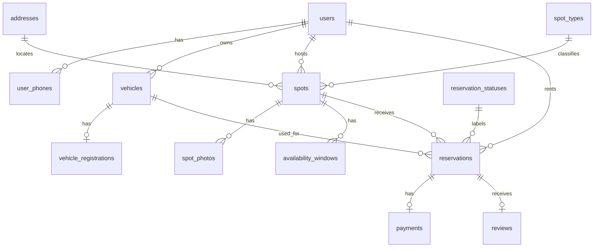
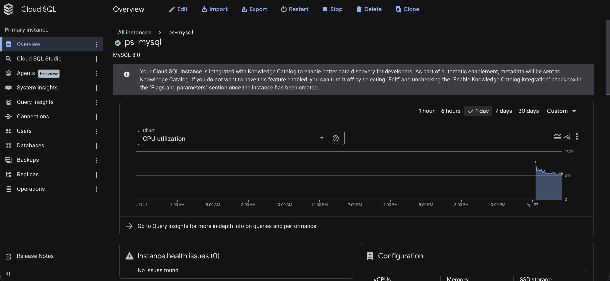
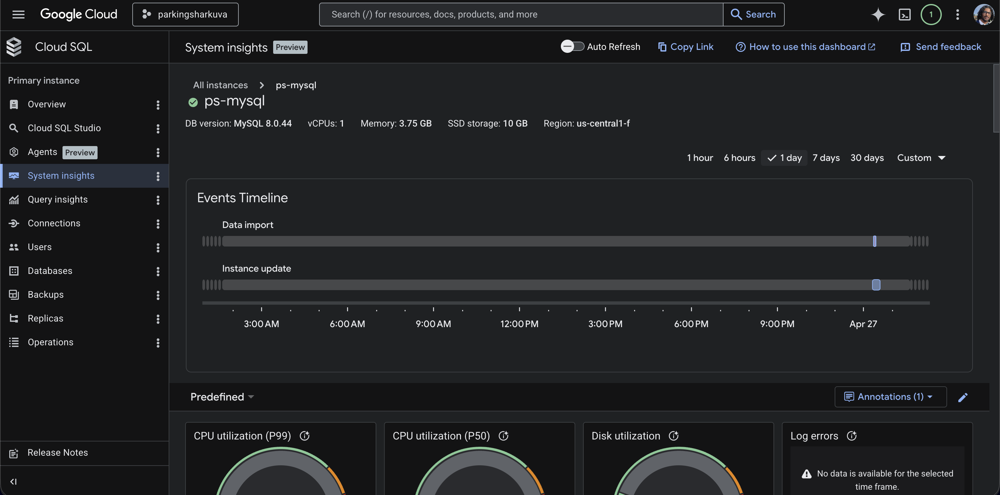

# Parking Shark — Final Report

CS 4750 Database Systems — Spring 2026

**Team members:**
- Adithya Balasubramaniam (rfb3mg)
- Rohan Singh (psw2uw)
- Angad Brar (zqq4hx)
- Visvajit Murali (dpc8jy)

**Source code:** https://github.com/visva-murali/parking-shark

**Live app (GCP):** https://parkingsharkuva.ue.r.appspot.com

---

## 1. Database Design

Parking Shark is a peer-to-peer parking marketplace. Users can list parking spots as hosts and reserve spots as renters. The relational schema is normalized around users, vehicles, addresses, spot listings, availability, reservations, payments, and reviews.

### Final E-R Diagram



### Final Schema Statements

The full schema is in `sql/schema.sql`. The 13 normalized application tables are defined as follows:

```sql
-- 1.1 users
CREATE TABLE users (
    user_id      INT PRIMARY KEY AUTO_INCREMENT,
    computing_id VARCHAR(32) NOT NULL UNIQUE,
    first_name   VARCHAR(64) NOT NULL,
    last_name    VARCHAR(64) NOT NULL,
    email        VARCHAR(255) NOT NULL UNIQUE,
    created_at   DATETIME NOT NULL
);

-- 1.2 user_phones  (multi-valued attribute of users)
CREATE TABLE user_phones (
    user_id      INT NOT NULL,
    phone_number VARCHAR(20) NOT NULL,
    PRIMARY KEY (user_id, phone_number),
    FOREIGN KEY (user_id) REFERENCES users(user_id)
);

-- 1.3 vehicles
CREATE TABLE vehicles (
    vehicle_id INT PRIMARY KEY AUTO_INCREMENT,
    user_id    INT NOT NULL,
    make       VARCHAR(64) NOT NULL,
    model      VARCHAR(64) NOT NULL,
    year       SMALLINT NULL,
    color      VARCHAR(32) NULL,
    FOREIGN KEY (user_id) REFERENCES users(user_id)
);

-- 1.4 vehicle_registrations
CREATE TABLE vehicle_registrations (
    vehicle_id    INT PRIMARY KEY,
    license_plate VARCHAR(16) NOT NULL UNIQUE,
    plate_state   CHAR(2) NOT NULL,
    expires_on    DATE NULL,
    is_verified   BOOLEAN NOT NULL DEFAULT FALSE,
    verified_at   DATETIME NULL,
    FOREIGN KEY (vehicle_id) REFERENCES vehicles(vehicle_id)
);

-- 1.5 addresses
CREATE TABLE addresses (
    address_id INT PRIMARY KEY AUTO_INCREMENT,
    street     VARCHAR(255) NOT NULL,
    city       VARCHAR(64) NOT NULL,
    state      CHAR(2) NOT NULL,
    zip_code   VARCHAR(10) NOT NULL
);

-- 1.6 spot_types  (lookup table)
CREATE TABLE spot_types (
    spot_type_id INT PRIMARY KEY AUTO_INCREMENT,
    type_name    VARCHAR(32) NOT NULL UNIQUE
);

-- 1.7 spots
CREATE TABLE spots (
    spot_id      INT PRIMARY KEY AUTO_INCREMENT,
    host_user_id INT NOT NULL,
    address_id   INT NOT NULL,
    spot_type_id INT NOT NULL,
    hourly_rate  DECIMAL(8,2) NOT NULL,
    is_active    BOOLEAN NOT NULL DEFAULT TRUE,
    instructions TEXT NULL,
    FOREIGN KEY (host_user_id) REFERENCES users(user_id),
    FOREIGN KEY (address_id)   REFERENCES addresses(address_id),
    FOREIGN KEY (spot_type_id) REFERENCES spot_types(spot_type_id)
);

-- 1.8 spot_photos
CREATE TABLE spot_photos (
    photo_id    INT PRIMARY KEY AUTO_INCREMENT,
    spot_id     INT NOT NULL,
    photo_url   TEXT NOT NULL,
    uploaded_at DATETIME NOT NULL,
    FOREIGN KEY (spot_id) REFERENCES spots(spot_id)
);

-- 1.9 availability_windows
CREATE TABLE availability_windows (
    window_id         INT PRIMARY KEY AUTO_INCREMENT,
    spot_id           INT NOT NULL,
    start_time        DATETIME NOT NULL,
    end_time          DATETIME NOT NULL,
    availability_kind VARCHAR(16) NOT NULL,
    FOREIGN KEY (spot_id) REFERENCES spots(spot_id)
);

-- 1.10 reservation_statuses  (lookup table)
CREATE TABLE reservation_statuses (
    status_id   INT PRIMARY KEY AUTO_INCREMENT,
    status_name VARCHAR(32) NOT NULL UNIQUE
);

-- 1.11 reservations
CREATE TABLE reservations (
    reservation_id         INT PRIMARY KEY AUTO_INCREMENT,
    spot_id                INT NOT NULL,
    renter_user_id         INT NOT NULL,
    vehicle_id             INT NOT NULL,
    status_id              INT NOT NULL,
    start_time             DATETIME NOT NULL,
    end_time               DATETIME NOT NULL,
    hourly_rate_at_booking DECIMAL(8,2) NOT NULL,
    total_cost             DECIMAL(10,2) NOT NULL,
    created_at             DATETIME NOT NULL,
    FOREIGN KEY (spot_id)        REFERENCES spots(spot_id),
    FOREIGN KEY (renter_user_id) REFERENCES users(user_id),
    FOREIGN KEY (vehicle_id)     REFERENCES vehicles(vehicle_id),
    FOREIGN KEY (status_id)      REFERENCES reservation_statuses(status_id)
);

-- 1.12 payments
CREATE TABLE payments (
    payment_id     INT PRIMARY KEY AUTO_INCREMENT,
    reservation_id INT NOT NULL UNIQUE,
    amount         DECIMAL(10,2) NOT NULL,
    paid_at        DATETIME NULL,
    method         VARCHAR(32) NULL,
    payment_status VARCHAR(32) NOT NULL,
    FOREIGN KEY (reservation_id) REFERENCES reservations(reservation_id)
);

-- 1.13 reviews
CREATE TABLE reviews (
    reservation_id INT PRIMARY KEY,
    rating         TINYINT NOT NULL,
    comment        TEXT NULL,
    created_at     DATETIME NOT NULL,
    FOREIGN KEY (reservation_id) REFERENCES reservations(reservation_id)
);
```

---

## 2. Database Programming

### Database Hosting

**Development:** MySQL 8 running locally.

**Production / shared database for demo:** Cloud SQL — MySQL 8.0 — hosted on Google Cloud Platform.

- GCP project: `parkingsharkuva`
- Cloud SQL instance: `ps-mysql` (`parkingsharkuva:us-central1:ps-mysql`)
- Region: us-central1
- Public IP: `34.57.34.113`
- Database name: `parking_shark`

**Cloud SQL instance on GCP (Cloud SQL Overview — ps-mysql, MySQL 8.0, us-central1):**



**Cloud SQL System Insights — ps-mysql (MySQL 8.0.44, vCPUs: 1, Memory: 3.75 GB, SSD: 10 GB, Region: us-central1-f):**



### App Hosting

**Development:** Node.js 20, Express 4, EJS, Bootstrap 5, MySQL 8.

**Production:** Google App Engine Standard — Node.js 20 — region us-east1.

- GCP project: `parkingsharkuva`
- Live URL: **https://parkingsharkuva.ue.r.appspot.com**

### Deployment and Run Instructions

#### Local development

1. Install Node.js 20 and MySQL 8.
2. Install dependencies:

```bash
npm install
```

3. Create and seed the database:

```bash
mysql -u root -p < sql/schema.sql
mysql -u root -p < sql/migration_auth.sql
```

4. Edit `sql/grants.sql` and replace both `REPLACE_WITH_STRONG_PW` placeholders with real passwords, then run:

```bash
mysql -u root -p < sql/grants.sql
```

5. Configure environment variables:

```bash
cp .env.example .env
# Set DB_HOST, DB_PORT, DB_NAME, DB_USER, DB_PASS, SESSION_SECRET
```

6. Start the app:

```bash
npm start
```

Open `http://localhost:3000`. Seed users can log in with password `password123`, for example `ac@virginia.edu`.

#### GCP deployment (extra credit)

Prerequisites: `gcloud` CLI authenticated, access to `parkingsharkuva` project.

```bash
gcloud config set project parkingsharkuva
gcloud app deploy app.yaml --quiet
```

App Engine uploads changed files and shifts traffic to the new version automatically (~3 min). The `app.yaml` file at the project root contains all production environment variables (it is excluded from git to protect secrets).

### Advanced SQL Incorporated in the App

The app uses the advanced SQL objects defined in `sql/schema.sql`.

#### Trigger — `prevent_double_booking`

This trigger runs `BEFORE INSERT` on `reservations`. It checks whether the same spot already has an overlapping `Pending` or `Confirmed` reservation. If a conflict exists it raises `SQLSTATE '45000'`, aborting the insert. This protects the database even if two users attempt to reserve the same spot concurrently.

The app uses it implicitly through the `create_booking` stored procedure. When a conflict is detected the booking route catches the error and shows the user a flash message:

```js
// routes/reservations.js
try {
  await conn.query('CALL create_booking(?, ?, ?, ?, ?, ?, @new_id)', [
    spotId, req.session.user.user_id, vehicleId,
    start_time, end_time, payment_method || 'Credit Card',
  ]);
} catch (e) {
  if (e.sqlState === '45000') {
    req.session.flash = { type: 'danger', msg: e.sqlMessage };
    return res.redirect(`/spots/${spotId}`);
  }
  throw e;
}
```

#### Stored Procedure — `create_booking`

Called from `routes/reservations.js` via:

```js
await conn.query('CALL create_booking(?, ?, ?, ?, ?, ?, @new_id)', [
  spotId,
  req.session.user.user_id,
  vehicleId,
  start_time,
  end_time,
  payment_method || 'Credit Card',
]);
const [[{ '@new_id': reservationId }]] = await conn.query('SELECT @new_id');
```

The stored procedure performs these steps atomically inside a single transaction:
1. Fetches the current hourly rate for the spot
2. Calculates total cost based on duration (fractional hours)
3. Checks for double-booking conflicts
4. Inserts the reservation with status `Pending`
5. Creates a corresponding payment record with status `Pending`
6. Returns the new `reservation_id` via an OUT parameter

#### CHECK Constraints

Five constraints enforce valid domain values at the database level regardless of application validation:

| Constraint | Rule |
|---|---|
| `chk_rating_range` | `rating BETWEEN 1 AND 5` |
| `chk_hourly_rate_positive` | `hourly_rate > 0` |
| `chk_payment_status_values` | `payment_status IN ('Pending','Paid','Refunded','Failed')` |
| `chk_availability_kind_values` | `availability_kind IN ('Available','Blocked')` |
| `chk_reservation_time_order` | `end_time > start_time` |

---

## 3. Database Security at the Database Level

Database-level security is defined in `sql/grants.sql`.

The app uses the `ps_app` MySQL account for all end-user operations. This account has only the minimum DML privileges needed by the web application. Developers use the `ps_dev` account with full privileges on `parking_shark.*`.

**`ps_app` — app user (least privilege):**
- `SELECT, INSERT, UPDATE, DELETE` on all transactional tables (`users`, `user_phones`, `vehicles`, `vehicle_registrations`, `addresses`, `spots`, `spot_photos`, `availability_windows`, `reservations`, `payments`, `reviews`)
- `SELECT` only on lookup tables (`spot_types`, `reservation_statuses`)
- `EXECUTE` on `parking_shark.create_booking` (stored procedure)
- `SELECT, INSERT, UPDATE, DELETE, CREATE` on `parking_shark.sessions` (session store)
- DDL operations explicitly revoked: `DROP`, `ALTER`, `CREATE VIEW`, `CREATE ROUTINE`, `ALTER ROUTINE`, `TRIGGER`, `REFERENCES`, `GRANT OPTION`

**`ps_dev` — developer account:**
- `ALL PRIVILEGES ON parking_shark.*`

SQL privilege commands from `sql/grants.sql`:

```sql
CREATE USER 'ps_app'@'%' IDENTIFIED BY 'REPLACE_WITH_STRONG_PW';
GRANT SELECT, INSERT, UPDATE, DELETE ON parking_shark.users TO 'ps_app'@'%';
GRANT SELECT, INSERT, DELETE         ON parking_shark.user_phones TO 'ps_app'@'%';
GRANT SELECT, INSERT, UPDATE, DELETE ON parking_shark.vehicles TO 'ps_app'@'%';
GRANT SELECT, INSERT, UPDATE, DELETE ON parking_shark.vehicle_registrations TO 'ps_app'@'%';
GRANT SELECT, INSERT, UPDATE         ON parking_shark.addresses TO 'ps_app'@'%';
GRANT SELECT, INSERT, UPDATE, DELETE ON parking_shark.spots TO 'ps_app'@'%';
GRANT SELECT, INSERT, DELETE         ON parking_shark.spot_photos TO 'ps_app'@'%';
GRANT SELECT, INSERT, UPDATE, DELETE ON parking_shark.availability_windows TO 'ps_app'@'%';
GRANT SELECT, INSERT, UPDATE, DELETE ON parking_shark.reservations TO 'ps_app'@'%';
GRANT SELECT, INSERT, UPDATE, DELETE ON parking_shark.payments TO 'ps_app'@'%';
GRANT SELECT, INSERT, UPDATE, DELETE ON parking_shark.reviews TO 'ps_app'@'%';
GRANT SELECT ON parking_shark.spot_types TO 'ps_app'@'%';
GRANT SELECT ON parking_shark.reservation_statuses TO 'ps_app'@'%';
GRANT EXECUTE ON PROCEDURE parking_shark.create_booking TO 'ps_app'@'%';
REVOKE DROP, ALTER, CREATE VIEW, CREATE ROUTINE, ALTER ROUTINE,
       TRIGGER, REFERENCES, GRANT OPTION
    ON parking_shark.* FROM 'ps_app'@'%';

CREATE USER 'ps_dev'@'%' IDENTIFIED BY 'REPLACE_WITH_STRONG_PW';
GRANT ALL PRIVILEGES ON parking_shark.* TO 'ps_dev'@'%';
```

---

## 4. Database Security at the Application Level

Application-level security is implemented through password hashing, server-side sessions with session regeneration, authorization middleware, ownership checks, and parameterized SQL.

### Password hashing

Passwords are hashed with bcrypt (cost factor 12) on registration and compared on login. Plain-text passwords are never stored:

```js
// routes/auth.js — register
const hash = await bcrypt.hash(password, 12);
await conn.query(
  `INSERT INTO users (computing_id, first_name, last_name, email, password_hash, role, created_at)
   VALUES (?, ?, ?, ?, ?, 'user', NOW())`,
  [computing_id, first_name, last_name, email, hash],
);
```

```js
// routes/auth.js — login
if (!user || !(await bcrypt.compare(password, user.password_hash))) {
  return res.render('auth/login', {
    title: 'Log in',
    error: 'Invalid email or password.',  // generic — no user enumeration
    form: req.body,
  });
}
```

### Session management and session fixation prevention

On login, the session ID is regenerated before writing user data to prevent session fixation. The session is explicitly saved before the redirect to guarantee the async MySQL session store flushes the new session before the browser follows the redirect:

```js
// routes/auth.js — login
req.session.regenerate((err) => {
  if (err) return next(err);
  req.session.user = { user_id, computing_id, first_name, last_name, email, role };
  req.session.flash = { type: 'success', msg: `Welcome back, ${user.first_name}!` };
  req.session.save((saveErr) => {
    if (saveErr) return next(saveErr);
    res.redirect('/spots');
  });
});
```

Sessions are stored in MySQL via `express-mysql-session`. In production (App Engine), session cookies are set with `httpOnly: true`, `sameSite: 'lax'`, and `secure: true`. The app sets `trust proxy: 1` so Express correctly reads the `X-Forwarded-Proto` header from App Engine's TLS-terminating load balancer.

### Route authorization guards (`middleware/auth.js`)

```js
function requireLogin(req, res, next) {
  if (!req.session.user) {
    req.session.flash = { type: 'warning', msg: 'Please log in to continue.' };
    return res.redirect('/login');
  }
  next();
}

async function requireSpotOwner(req, res, next) {
  const [rows] = await pool.query(
    'SELECT spot_id FROM spots WHERE spot_id = ? AND host_user_id = ?',
    [req.params.id, req.session.user.user_id],
  );
  if (!rows.length) return res.status(403).render('error', { title: 'Forbidden', message: 'Access denied.' });
  next();
}
```

`requireLogin` guards all protected routes. `requireSpotOwner` queries the database to confirm the session user owns the spot before allowing edits or deletions. `requireReservationOwner` does the same for reservation-specific actions, ensuring only the renter or the spot's host can view or modify a reservation.

### Ownership check before booking

The booking route verifies the submitted vehicle belongs to the logged-in user before calling the stored procedure, preventing cross-user abuse:

```js
const [[vehicle]] = await conn.query(
  'SELECT vehicle_id FROM vehicles WHERE vehicle_id = ? AND user_id = ?',
  [vehicleId, req.session.user.user_id],
);
if (!vehicle) {
  req.session.flash = { type: 'danger', msg: 'Choose one of your own vehicles.' };
  return res.redirect(`/spots/${spotId}`);
}
```

### Parameterized queries (SQL injection prevention)

All database access uses `?` placeholders — no string concatenation is ever used in SQL:

```js
const [rows] = await pool.query(
  'SELECT user_id, email, password_hash FROM users WHERE email = ?',
  [email],
);
```

---

## 5. Application Requirements Coverage

| Requirement | Implementation |
|---|---|
| **Retrieve** | Browse spots (`GET /spots`), spot detail (`GET /spots/:id`), renter dashboard, host dashboard, profile, vehicles, reservation detail — 20+ SELECT queries across routes |
| **Add** | Register users, list a spot, add vehicle, add vehicle registration, create reservation (`CALL create_booking`), add review, add photo, add availability window, add phone number |
| **Update** | Edit profile, edit spot, verify vehicle registration, confirm/complete/cancel reservation, extend reservation, mark payment paid, update review |
| **Delete** | Delete review, phone number, vehicle registration, vehicle (safe — only if no reservations), photo, availability window, cancelled reservation and its payment, spot (only if no reservations) |
| **Sort** | Browse page sortable by price ascending, price descending, or newest |
| **Search / filter** | Search by street, city, or zip; filter by spot type and max price; filter by date-time availability window |
| **Export** | `/export/reservations.csv` (renter history), `/export/host-bookings.csv` (host bookings) — CSV download via `routes/data.js` |
| **Multiple users** | Sessions stored in MySQL (`express-mysql-session`) shared across all App Engine instances; `prevent_double_booking` trigger prevents concurrent booking conflicts |
| **Returning users** | Persistent bcrypt-authenticated accounts; all renter/host queries scoped by `req.session.user.user_id`; users retrieve their existing vehicles, spots, reservations, reviews, and profile on every login |
| **Shared database** | Cloud SQL MySQL 8.0 instance `ps-mysql` on GCP (`parkingsharkuva:us-central1:ps-mysql`) — single centralized database accessed by all users via the live App Engine deployment at https://parkingsharkuva.ue.r.appspot.com |
| **Dynamic behavior** | (1) Live booking cost preview (updates in real time as the user selects start/end time); (2) live price-range slider on browse page (client-side filtering with no page reload); (3) inline reservation status buttons on host dashboard via `fetch` (no reload) |

---

## 6. Demo Script

1. Open https://parkingsharkuva.ue.r.appspot.com in a browser. Confirm the live GCP app loads.
2. Log in as `ac@virginia.edu` / `password123` (Alice Chen — admin + host).
3. Browse spots — demonstrate search by street/city/zip, type filter, price slider (client-side, no reload), and date-time availability filter.
4. Sort by price ascending, price descending, and newest.
5. Export CSV from `/export/host-bookings.csv` and show the downloaded file.
6. Add a new spot with address, type, hourly rate, instructions, photo, and availability window.
7. Log out, then log in as `fh@virginia.edu` / `password123` (Frank Harris — renter).
8. Add or verify a vehicle.
9. Reserve a spot — show the cost preview updating live, then submit. Confirm the stored procedure creates both a reservation and a pending payment record in the database.
10. Log back in as the host (`ac@virginia.edu`). From the host dashboard, confirm or complete the reservation using the inline status button (no page reload).
11. Return as renter, mark payment paid, leave a review, then update and delete the review.
12. Demonstrate delete behavior: delete an availability window, delete a photo, delete a cancelled reservation.
13. Open the app in two different browsers simultaneously (different users) to show multi-user behavior with the shared GCP database.

---

## 7. Individual Reflection and Peer Evaluation

Do not include individual reflection in this project report PDF. Each team member must submit the Microsoft Forms peer evaluation separately before the deadline:

https://forms.office.com/r/8XCV8P7utY
